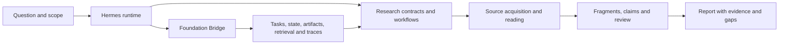

# Ultra Deep Research

[Русский](README.ru.md) · [Release](https://github.com/olegeklepikov-collab/ultra-deep-research/releases/tag/v0.41.0a1-r153-v22) · [Installation](docs/en/installation.md) · [Tool reference](docs/reference/tools.md)

**Evidence-traceable research workflows for Hermes.** Ultra Deep Research turns a question into a bounded plan, retrieves and examines source material, records the basis of candidate claims, and produces a report with explicit gaps and qualification status.

The project combines deterministic contract checks with model-assisted research. It separates source acquisition, exact fragment verification, interpretation, independent review, acceptance, release, and delivery. A successful tool call or matching quotation is not treated as proof that a scientific conclusion is true.

**In this release:** [model classes](docs/en/model-classes.md) decouple a research request from a particular vendor/model. Operators update the mapping in Hermes configuration; the concrete executed route remains recorded. Earlier r152/v21 archives remain unchanged.

## Current publication

| Item | Published state |
|---|---|
| Release | [r153 / v22](https://github.com/olegeklepikov-collab/ultra-deep-research/releases/tag/v0.41.0a1-r153-v22), **prerelease** |
| Research component | `ultra-deep-research` `0.41.0a1`, revision r153; **147 registered tools** |
| Foundation component | `hermes-foundation-bridge` `0.12.0`, revision v22; **64 tools and 5 hooks** |
| Distribution | [Combined release archive](https://github.com/olegeklepikov-collab/ultra-deep-research/releases/download/v0.41.0a1-r153-v22/hermes-local-release-r153-v22.zip), with component archives, Foundation signature, public key, checksum manifest, and `documentation/` snapshot |
| Software verification | Exact package checks, affected tests, local installation, applicable rollback checks, native signature verification, and twelve-class restore |
| Integration status | `integration_ready` on the validated local stand |
| Research qualification | Independent per profile and scope; no general Deep/Ultra/Academic qualification is claimed |
| Production activation | Not performed by publication |

This documentation describes that release. Install the exact component archives from the verified bundle; the tagged source tree is not a substitute for the archive manifest, and documentation on `main` can evolve independently.

## What the system does

| Area | Functional behavior |
|---|---|
| Research framing | Question and scope contracts, domain decomposition, concepts, competing explanations, and versioned changes |
| Bounded execution | Explicit model, time, token, source, and cost-estimate limits; retained attempts and configuration fingerprints |
| Search and discovery | Search, Deep, Ultra, and Academic entrypoints; source-family routing, coverage ledgers, and explicit missing coverage |
| Source examination | Captured response bytes, exact source references, bounded full-text reading, document chunks, PDF structure and selected page images |
| Claims and evidence | Exact quotations and locators, candidate-claim evaluation, semantic checks, independence assessment, and contradiction handling |
| Quantitative work | Numerical reproduction contracts and source-linked spreadsheet reanalysis; incompatible data are not silently pooled |
| Review and reporting | Screening/adjudication records, synthesis and challenge checks, structured results, Markdown reports, and unresolved obligations |
| Recovery and provenance | Immutable attempt records, unknown-outcome reconciliation, artifact hashes, and restart/restore evidence |

See [workflows](docs/en/workflows.md) for executable entrypoints and [all 147 research tools](docs/reference/tools.md) for the contract surface. A registered tool, a configured provider, and a qualified capability are different states.

## Architecture at a glance



Hermes owns the model loop, sessions, plugin loading, and gateway. Research owns research contracts and bounded workflows. Foundation connects public tools and hooks to isolated state and storage services. It does not introduce a second agent loop. [Architecture and trust boundaries →](docs/en/architecture.md)

## Start here

1. Read [installation and verification](docs/en/installation.md). Use a new Hermes home for the full Foundation deployment.
2. Install the verified `research.zip` bytes through the local Git procedure, then run the plugin doctor before enabling it.
3. Configure a supported model route and the source route required by the chosen workflow.
4. Start with a public, non-sensitive question and a fresh output directory. Inspect the resulting status and source coverage before using a conclusion.

```sh
gh release download v0.41.0a1-r153-v22 --repo olegeklepikov-collab/ultra-deep-research
```

Follow [installation](docs/en/installation.md) to verify the bundle and install its exact Research archive into the selected Hermes instance. Foundation databases, containers and credentials require separate provisioning.

## Read the result, not just the exit code

`partial`, `review_required`, and `insufficient_evidence` preserve useful work while withholding unsupported conclusions. `unknown_outcome` means an external operation may already have occurred and must be reconciled before retrying. `integration_ready` describes software integration, not the scientific reliability of every answer.

The prior r152 smoke run completed with `insufficient_evidence` and no released claims. For r153/v22, the installed model-class route, health and restore checks were recorded separately. Neither observation is a successful scientific benchmark; the narrow twenty-case FAIR set remains incomplete and does not establish universal qualification.

## Documentation

- [Installation, OAuth, update and rollback](docs/en/installation.md)
- [Architecture, storage ownership and evidence boundaries](docs/en/architecture.md)
- [Research workflows, budgets and artifacts](docs/en/workflows.md)
- [Publication, verification, operations and limitations](docs/en/release-and-operations.md)
- [Bilingual Research tool reference](docs/reference/tools.md)
- [Bilingual Foundation tools and hooks](docs/reference/foundation.md)
- [Model classes in r153/v22](docs/en/model-classes.md)
- [Contributing](CONTRIBUTING.md)

## License

Project code is licensed under [Apache-2.0](LICENSE). Hermes, storage engines, model providers, and external data sources retain their own licenses and service terms.
