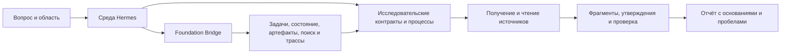

# Ultra Deep Research

[English](README.md) · [Выпуск](https://github.com/olegeklepikov-collab/ultra-deep-research/releases/tag/v0.41.0a1-r152-v21) · [Установка](docs/ru/installation.md) · [Каталог инструментов](docs/reference/tools.md)

**Исследовательские процессы Hermes с проверяемой связью выводов и источников.** Ultra Deep Research преобразует вопрос в ограниченный план, получает и изучает материалы, фиксирует основания предварительных утверждений и формирует отчёт с явными пробелами и статусом квалификации.

Проект сочетает детерминированные проверки контрактов с исследованием при помощи модели. Получение источника, проверка точного фрагмента, интерпретация, независимая проверка, приёмка, выпуск и доставка имеют разные статусы. Успешный вызов инструмента или совпадение цитаты не удостоверяет истинность научного вывода.

**Текущая разработка:** [классы моделей](docs/ru/model-classes.md) отделяют исследовательский запрос от конкретной пары поставщика и модели. Оператор обновляет сопоставление в настройках Hermes; фактический маршрут сохраняется в квитанции. Подписанный выпуск ниже не изменяется.

## Текущая публикация

| Позиция | Опубликованное состояние |
|---|---|
| Выпуск | [r152 / v21](https://github.com/olegeklepikov-collab/ultra-deep-research/releases/tag/v0.41.0a1-r152-v21), **предварительный выпуск** |
| Исследовательский компонент | `ultra-deep-research` `0.41.0a1`, редакция r152; **147 зарегистрированных инструментов** |
| Компонент основания | `hermes-foundation-bridge` `0.12.0`, редакция v21; **64 инструмента и 5 обработчиков событий** |
| Поставка | [Общий архив](https://github.com/olegeklepikov-collab/ultra-deep-research/releases/download/v0.41.0a1-r152-v21/hermes-local-release-r152-v21.zip): архивы компонентов, подпись Foundation, открытый ключ и манифест хешей |
| Проверка ПО | Точные пакеты, затронутые правила, локальная установка, применимые проверки отката, штатная проверка подписи и восстановление 12 классов данных |
| Состояние интеграции | `integration_ready` на проверенном локальном стенде |
| Исследовательская квалификация | Отдельна для каждого профиля и области; общая квалификация Deep/Ultra/Academic не заявляется |
| Производственная активация | Публикацией не выполнялась |

Документация описывает этот выпуск. Для установки используйте [исходники по тегу](https://github.com/olegeklepikov-collab/ultra-deep-research/tree/v0.41.0a1-r152-v21) или точному коммиту: документация в `main` может изменяться независимо от неизменяемой поставки.

## Функциональные возможности

| Область | Поведение |
|---|---|
| Постановка исследования | Контракты вопроса и области, предметная декомпозиция, понятия, конкурирующие объяснения и версионированные изменения |
| Ограниченное исполнение | Явные пределы модели, времени, токенов, источников и оценки расходов; сохранённые попытки и отпечатки настроек |
| Поиск | Точки входа Search, Deep, Ultra и Academic; выбор семейств источников, журналы охвата и явные пробелы |
| Изучение материалов | Исходные ответы, точные ссылки, ограниченное чтение полного текста, части документов, структура PDF и выбранные изображения страниц |
| Утверждения и доказательства | Точные цитаты и координаты, оценка кандидатов утверждений, смысловая проверка, независимость опор и противоречия |
| Количественная работа | Контракты воспроизведения расчётов и повторный анализ таблиц со ссылками на ячейки; несовместимые данные не объединяются молча |
| Проверка и отчёты | Записи отбора и арбитража, проверка синтеза и возражений, структурированные результаты, Markdown-отчёты и незавершённые обязательства |
| Восстановление и происхождение | Записи попыток, сверка неизвестного исхода, хеши артефактов и свидетельства возобновления и восстановления |

Исполняемые команды описаны в [руководстве по процессам](docs/ru/workflows.md), контрактные интерфейсы — в [каталоге 147 инструментов](docs/reference/tools.md). Регистрация инструмента, настройка поставщика и квалификация возможности — разные состояния.

## Архитектура



Hermes управляет модельным циклом, сеансами, загрузкой расширений и шлюзом. Research задаёт исследовательские контракты и ограниченные процессы. Foundation связывает публичные инструменты и события с отдельными службами состояния и хранения. Второй агентный цикл не создаётся. [Архитектура и границы доверия →](docs/ru/architecture.md)

## Начало работы

1. Прочитайте [руководство по установке и проверке](docs/ru/installation.md). Полное основание разворачивается в новом домашнем каталоге Hermes.
2. Установите точный коммит Research и проверьте расширение перед включением.
3. Настройте поддержанный модельный маршрут и получение источников для выбранного процесса.
4. Начните с публичного вопроса без закрытых данных и нового каталога результатов. Перед использованием вывода изучите статус и охват источников.

```sh
hermes plugins install olegeklepikov-collab/ultra-deep-research   --ref 9077d24d5e7b6dda5db7902bac2a927503791db6 --no-enable
hermes plugins doctor ultra-deep-research --ci
hermes plugins enable ultra-deep-research --no-allow-tool-override
```

Команды устанавливают исследовательское расширение в выбранный экземпляр Hermes. Развёртывание баз, контейнеров и учётных данных Foundation описано отдельно.

## Как понимать результат

`partial`, `review_required` и `insufficient_evidence` сохраняют полезную работу, одновременно ограничивая неподтверждённые выводы. `unknown_outcome` означает, что внешнее действие уже могло состояться: перед повтором требуется сверка. `integration_ready` характеризует программную интеграцию, а не научную надёжность любого ответа.

Финальный контрольный запуск завершился штатным `insufficient_evidence` без выпущенных утверждений. Это подтверждает ограниченный путь завершения, но не успешный научный эталонный результат. Подготовленный набор из 20 FAIR-задач имеет узкую область; он не завершён и не использован для заявления универсальной квалификации.

## Документация

- [Установка, OAuth, обновление и откат](docs/ru/installation.md)
- [Архитектура, владение состоянием и доказательные границы](docs/ru/architecture.md)
- [Исследовательские процессы, бюджеты и результаты](docs/ru/workflows.md)
- [Публикация, подлинность, эксплуатация и ограничения](docs/ru/release-and-operations.md)
- [Двуязычный каталог инструментов Research](docs/reference/tools.md)
- [Инструменты и события Foundation](docs/reference/foundation.md)
- [Классы моделей в текущей разработке](docs/ru/model-classes.md)
- [Участие в разработке](CONTRIBUTING.md)

## Лицензия

Код проекта распространяется по [Apache-2.0](LICENSE). Hermes, системы хранения, поставщики моделей и внешние источники сохраняют собственные лицензии и условия использования.
